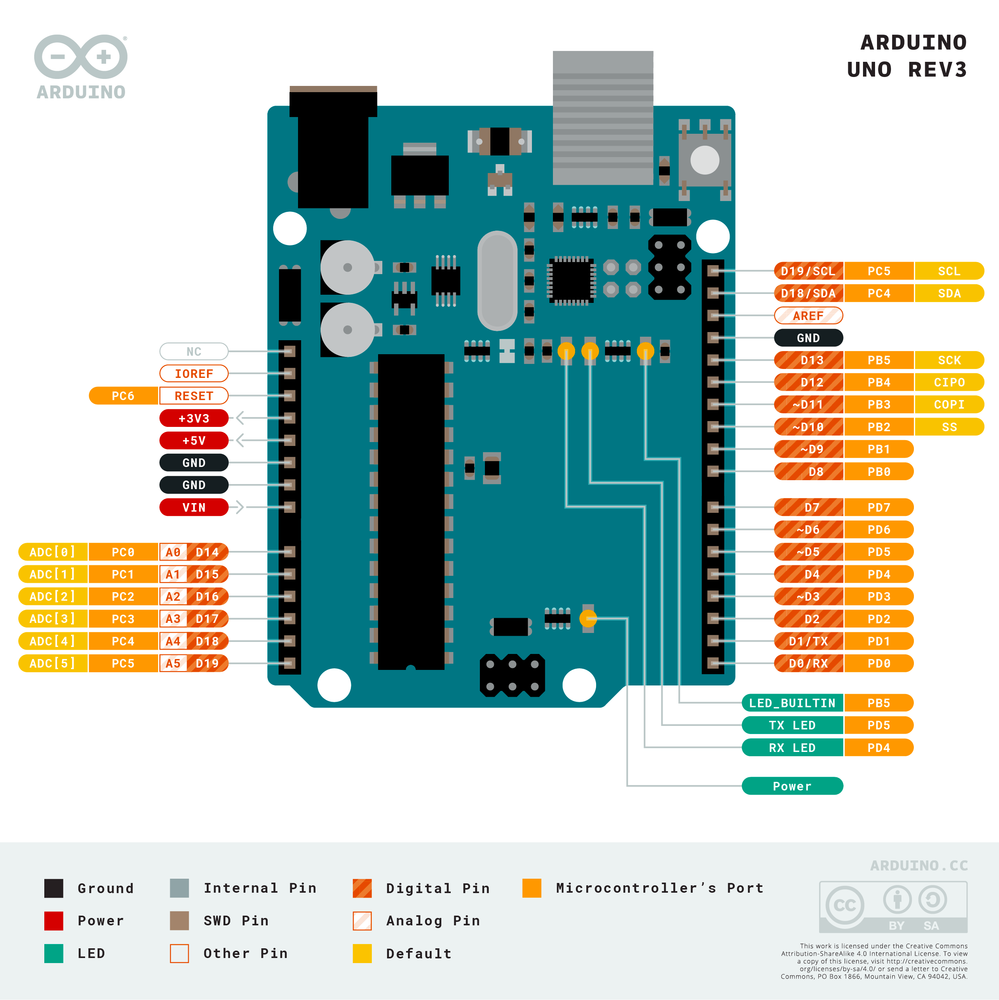

# 什么是 Arduino

Arduino 是一个开源的电子原型平台，包含硬件部分 (Arduino 开发板) 和软件部分 (Arduino IDE) 。

## 硬件部分

Arduino 硬件即可以独立运行，也可以和外部硬件传感器协同工作。

## 软件部分

[Arduino IDE](https://www.arduino.cc/en/software/) 是跨平台的的 Arduino 开发板的程序开发环境。可以通过 IDE
进行编程，开发完成后，可以将代码下载到 Arduino
硬件。除了使用 Arduino
IDE，也可以使用 [Arduino VS Code 插件](https://marketplace.visualstudio.com/items?itemName=vsciot-vscode.vscode-arduino)
进行开发。

## 应用场景

Arduino 可以适应多种应用场景，可以通过发挥想象力开发出经验的作品。以下是一些比较常见的应用场景：

1. 智能家居
2. 智能小车
3. 无人机
4. 机械臂
5. 3D 打印机
6. ...

## Arduino 开发板选型指南

[Arduino 官方开发板](https://www.arduino.cc/en/Main/Products)

以下是部分常见的官方开发板选型参考：

- [Arduino UNO](https://www.arduino.cc/en/Main/ArduinoBoardUno) - Arduino UNO 是一款经典的主控制器，适合初学者
- [Arduino DUE](https://docs.arduino.cc/hardware/due/) - 是第一块基于 32 位 ARM 的 Arduino 主控制器
- [Arduino MEGA 2560](https://docs.arduino.cc/hardware/mega-2560/) - Arduino MEGA 54 个数字口，16 个模拟口，
  适合于需要需要较多引脚来控制外部设备以及采集传感器数据的项目场景
- [Arduino YUN](https://docs.arduino.cc/retired/boards/arduino-yun/) - Arduino Yun 是一款基于 ATmega32u4 和 Atheros
  AR9331 的主控器。Atheros 支持基于Linux分支 OpenWRT 平台下
  Linino 系统。适用于物联网开发者。
- [Arduino NANO](https://www.arduino.cc/en/Main/ArduinoBoardNano) - 尺寸较小，与 UNO 具有相同的核心微控制器，NANO 的引脚数量略多于
  UNO，适合于对体积和质量有要求的场景。

更详细的选型需要根据实际需要进行选择。

## Arduino UNO REV3 介绍

在 Arduino 开发板家族中，Arduino UNO REV3 是一款最适合 Arduino 初学者的常用的入门开发板。**本教程主要以 Arduino UNO REV3
进行学习**，下面就以 Arduino UNO REV3 进行介绍

### 技术参数

|                  |                                             |
|------------------|---------------------------------------------|
| 微控制器             | ATmega328P                                  |
| 工作电压             | 5V                                          |
| 输入电压(推荐)         | 7-12V                                       |
| 输入电压(极限)         | 6-20V                                       |
| 数字输入输出引脚         | 14（其中有6个引脚可作为PWM引脚）                         |
| PWM引脚            | 6                                           |
| 模拟输入引脚           | 6                                           |
| 输入/输出引脚直流电流      | 20 mA                                       |
| 3.3V引脚电流         | 50 mA                                       |
| Flash Memory(闪存) | 32 KB (ATmega328P) 其中由 0.5 KB 用于 bootloader |
| SRAM             | 2 KB (ATmega328P)                           |
| EEPROM           | 1 KB (ATmega328P)                           |
| 时钟频率             | 1 (USB)                                     |
| 内置LED引脚          | 16 MHz                                      |

### 引脚说明图

1. 输入/输出引脚
    - 14 个数字输入/输出引脚：图中右侧 D0 - D13 (其中以 `~` 开头的 3、5、6、9、10、11 支持 PMW)
    - 6 个模拟输入引脚：图中左侧 A0 - A5
2. 电源 - UNO 支持两种供电方式
    - USB 口供电
    - 6 - 12 DV 电源
3. +3V3 - 3.3V 电压伏输出引脚
4. +5V - 5V 电压输出引脚
5. LED_BUILTIN - 内置 LED 灯，对应 13 号引脚
6. TX LED 、RX LED - 串口输入、输出指示灯，比如下载程序到到 Arduino 时，这两个灯光就会不停的闪烁
7. GND - 接地引脚
8. 微控制器 - ATmega328P

## 相关文档

[Arduino 官方开发板](https://www.arduino.cc/en/Main/Products)
[Arduino UNO REV3 Datasheet](https://docs.arduino.cc/static/06cf811f53a574e29e21bd7906e8697c/A000066-datasheet.pdf)

