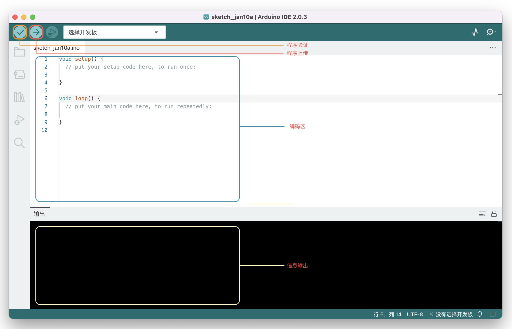

# 快速开始

## 开发板准备

Arduino 开发板的购买渠道有很多，可以选择官方开发板，也可以选择第三方克隆开发板，可以根据个人情况来定。 无论是官方开发板还是克隆板都是合法的产品，所以不存在所谓的「山寨板」这一概念。

另外，初学者推荐可以购买 Arduino UNO R3 开发套件进行学习，开发套件一般会包含一些开发案例、教程，及其所需要的相关电子元件，不需要单独购买各个元件。

## 开发环境准备

下载 Arduino IDE 并安装，官方下载地址：[https://www.arduino.cc/en/software](https://www.arduino.cc/en/software)  

## Arduino IDE 介绍

